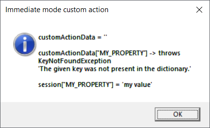
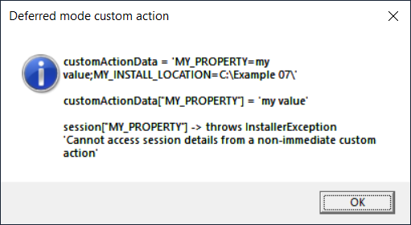

# 07_CSharpCustomAction

## Creating custom action project

Extensions that [integrate WiX Toolset into Visual Studio](https://marketplace.visualstudio.com/publishers/WixToolset) come with a project template for a C# Custom Action. The template of a custom action looks like this:
```C#
  public class CustomActions
  {
    [CustomAction]
    public static ActionResult CustomAction1(Session session)
    {
      session.Log("Begin CustomAction1");

      return ActionResult.Success;
    }
  }
```
Quote from the [documentation](https://documentation.help/MS-Deployment-Tools/WindowsInstaller.htm): *"A custom action method must be defined as public and static, take a single Microsoft.Deployment.WindowsInstaller.Session object as a parameter, and return an ActionResult enumeration value."*

## Writing immediate and deferred custom action

We will define two custom actions - one scheduled for immediate execution and one for deferred execution (see [here](../04_PowerShellPreconditionCustomAction#overview-of-install-stages) for the difference between the two). Also, note the difference in how the two custom actions access MY_PROPERTY.

Immediate custom action:
```C#
    [CustomAction]
    public static ActionResult MyImmediateCustomAction(Session session)
    {
      // This logging is visible in MsiExec log file
      session.Log($"Begin MyImmediateCustomAction");

      // In immediate custom action, WiX property values can be accessed directly (using session indexer)
      // CustomActionData.ToString() is empty and accessing a property using CustomActionData indexer throws exception
      CustomActionData customActionData = session.CustomActionData;

      string message =
        $"customActionData = '{customActionData}'{Environment.NewLine}{Environment.NewLine}" +
        $"customActionData[\"MY_PROPERTY\"] -> throws KeyNotFoundException{Environment.NewLine}" +
        $"'The given key was not present in the dictionary.'{Environment.NewLine}{Environment.NewLine}" +
        $"session[\"MY_PROPERTY\"] = '{session["MY_PROPERTY"]}'";

      // System.Diagnostics.Debugger.Launch();
      MessageBox.Show(message, "Immediate mode custom action", MessageBoxButtons.OK, MessageBoxIcon.Information);

      session.Log($"MY_PROPERTY value in MyImmediateCustomAction = {session["MY_PROPERTY"]}");
      session.Log($"MY_INSTALL_LOCATION value in MyImmediateCustomAction = {session["MY_INSTALL_LOCATION"]}");
      session.Log("End MyImmediateCustomAction");

      return ActionResult.Success;
    }
```

Deferred custom action:
```C#
    [CustomAction]
    public static ActionResult MyDeferredCustomAction(Session session)
    {
      // This logging is visible in MsiExec log file
      session.Log($"Begin MyDeferredCustomAction");

      // In deferred custom action, WiX property values can only be accessed through CustomActionData
      // Accessing property value using session indexer throws exception
      CustomActionData customActionData = session.CustomActionData;

      string message =
        $"customActionData = '{customActionData}'{Environment.NewLine}{Environment.NewLine}" +
        $"customActionData[\"MY_PROPERTY\"] = '{customActionData["MY_PROPERTY"]}'{Environment.NewLine}{Environment.NewLine}" +
        $"session[\"MY_PROPERTY\"] -> throws InstallerException{Environment.NewLine}" +
        "'Cannot access session details from a non-immediate custom action'";

      // System.Diagnostics.Debugger.Launch();
      MessageBox.Show(message, "Deferred mode custom action", MessageBoxButtons.OK, MessageBoxIcon.Information);

      session.Log($"MY_PROPERTY value in MyDeferredCustomAction = {customActionData["MY_PROPERTY"]}");
      session.Log($"MY_INSTALL_LOCATION value in MyDeferredCustomAction = {customActionData["MY_INSTALL_LOCATION"]}");
      session.Log("End MyDeferredCustomAction");

      return ActionResult.Success;
    }
```

## Executing installer which contains custom actions

If we would initiate the installation with the following command line:
```
MsiExec /L*V `"installation.log`" /i `"07_InstallerWithMyCSharpCustomAction.msi`" MY_PROPERTY=`"my value`" MY_INSTALL_LOCATION=`"c:\Example 07`"
```
For immediate custom action we would see the following text in *installation.log* and see the following message box:
```
SFXCA: Binding to CLR version v4.0.30319
Calling custom action 07_MyCSharpCustomAction!_07_MyCSharpCustomAction.MyCustomActions.MyImmediateCustomAction
Begin MyImmediateCustomAction
MY_PROPERTY value in MyImmediateCustomAction = my value
MY_INSTALL_LOCATION value in MyImmediateCustomAction = C:\Example 07\
End MyImmediateCustomAction
```
<p align="center">
    
</p>

For deferred custom action we would see the following text in *installation.log* and see the following message box:
```
SFXCA: Binding to CLR version v4.0.30319
Calling custom action 07_MyCSharpCustomAction!_07_MyCSharpCustomAction.MyCustomActions.MyDeferredCustomAction
Begin MyDeferredCustomAction
MY_PROPERTY value in MyDeferredCustomAction = my value
MY_INSTALL_LOCATION value in MyDeferredCustomAction = C:\Example 07\
End MyDeferredCustomAction
```
<p align="center">
    
</p>

## Debugging custom actions

Custom actions can be debugged by uncommenting the following statement in code: `System.Diagnostics.Debugger.Launch();`\
Alternatively, when the message box is visible, VisualStudio can be attached to the `rundll32.exe` process.\
Once the 'OK' button is clicked, the next statement will be executed with the debugger attached.

## How are custom actions scheduled?

Both actions need a reference to the binary containing custom actions:
```xml
    <!-- Reference to 07_MyCSharpCustomAction.CA.dll -->
    <Binary Id="CustomActions" SourceFile="$(var.07_MyCSharpCustomAction.TargetDir)$(var.07_MyCSharpCustomAction.TargetName).CA.dll" />
```

Immediate custom action has:
- `Execute="immediate"`
- reference to the Binary element from the previous step
- reference to the custom action method name
```xml
    <!-- Definition of immediate custom action -->
    <CustomAction Id="MyCustomActionForReadingPropertyImmediate"
                  BinaryKey="CustomActions" Execute="immediate" DllEntry="MyImmediateCustomAction" />
```

Deferred custom action has:
- `Execute="deferred"`
- reference to the Binary element from the previous step
- reference to the custom action method name
```xml
    <!-- Definition of deferred custom action -->
    <CustomAction Id="MyCustomActionForReadingPropertyDeferred"
                  BinaryKey="CustomActions" Execute="deferred" DllEntry="MyDeferredCustomAction" />
```

Additionally, deferred custom action requires another custom action to pass property values to the deferred stage (to CustomActionData):
```xml
    <!--
    This CA is passing property values to the session.CustomActionData.
    This is done by making sure that the value of the Property attribute matches the name of the custom action.
    Deferred custom actions can only access property values through CustomActionData.
    This is not needed for immediate custom actions.
    Format of CustomActionData is "Key1=Value1;Key2=Value2;..."
    -->
    <CustomAction Id="My_Type_51_CA_For_Setting_CustomActionData"
                  Return="check"
                  Property="MyCustomActionForReadingPropertyDeferred" 
                  Value="MY_PROPERTY=[MY_PROPERTY];MY_INSTALL_LOCATION=[MY_INSTALL_LOCATION]" />
```

All three custom actions are then scheduled as part of InstallExecuteSequence (with C# custom actions executing only during initial installation):
```xml
    <!-- Scheduling execution of custom actions -->
    <InstallExecuteSequence>
      <Custom Action='My_Type_51_CA_For_Setting_CustomActionData' Before='InstallInitialize'></Custom>
      <Custom Action='MyCustomActionForReadingPropertyImmediate' Before='InstallFinalize'>
        NOT Installed AND NOT WIX_UPGRADE_DETECTED
      </Custom>
      <Custom Action='MyCustomActionForReadingPropertyDeferred' Before='InstallFinalize'>
        NOT Installed AND NOT WIX_UPGRADE_DETECTED
      </Custom>
    </InstallExecuteSequence>
```
See [here](../05_RememberPropertyPattern#defining-custom-actions-that-execute-only-during-installupgraderepairuninstall) for details on scheduling.