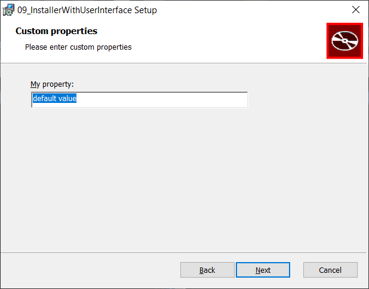

# 09_InstallerWithUserInterface

In this example, we will reuse the [06_RememberPropertyPatternComplete example](../06_RememberPropertyPatternComplete/) and add a user interface to the MSI.\
In the user interface, the user will be able to set the value for the install location and the value of one property.

## Predefined user interfaces

WiX comes with several predefined user interfaces described [here](https://wixtoolset.org/documentation/manual/v3/wixui/wixui_dialog_library.html) and [here](https://www.firegiant.com/wix/tutorial/user-interface/ui-wizardry/).\
The simplest one (`WixUI_Minimal`) just shows one dialog where the user needs to accept the shown license agreement.

Two steps are needed to include that dialog in the MSI:
- installer project must have a reference to `WixUIExtension.dll`
- in the installer wxs file, the following line must be added:
  ```xml
  <UIRef Id="WixUI_Minimal" />
  ```
Other types of predefined user interfaces come with dialogs that provide more customization options, such as:
- ability to choose install location
- ability to choose which features will be installed

## Integrating custom dialog

As a base installer, we will use [WixUI_InstallDir](https://wixtoolset.org//documentation/manual/v3/wixui/dialog_reference/wixui_installdir.html). This predefined user interface gives the ability to choose an install location. The ability to set custom property values will be added using a custom dialog.

Definition of the [UI element](https://wixtoolset.org/documentation/manual/v3/xsd/wix/ui.html) of WixUI_InstallDir is available [here](https://github.com/wixtoolset/wix3/blob/develop/src/ext/UIExtension/wixlib/WixUI_InstallDir.wxs). We wish to display our custom dialog after install location is selected and before the final dialog is displayed. From the WixUI_InstallDir definition, we can see that the dialog for choosing install location is called `InstallDirDlg` and the final dialog is called `VerifyReadyDlg`. This is how we should define the UI sequence to show our custom dialog ([MyCustomPropertiesDlg](MyCustomPropertiesDlg.wxs)) between the two mentioned dialogs:
```xml
    <UI Id="MyWixUI_InstallDir">
      <UIRef Id="WixUI_InstallDir" />

      <DialogRef Id="MyCustomPropertiesDlg" />

      <Publish Dialog="InstallDirDlg" Control="Next" Event="NewDialog" Value="MyCustomPropertiesDlg" Order="4">WIXUI_DONTVALIDATEPATH OR WIXUI_INSTALLDIR_VALID="1"</Publish>
      <Publish Dialog="VerifyReadyDlg" Control="Back" Event="NewDialog" Value="MyCustomPropertiesDlg" Order="1">1</Publish>
    </UI>
```

## Creating custom dialog

[MyCustomPropertiesDlg](MyCustomPropertiesDlg.wxs) is created based on [this sample](https://www.firegiant.com/system/files/samples/SampleWixUIAddDlg.zip) which is available [here](https://www.firegiant.com/wix/tutorial/user-interface/new-link-in-the-chain/).\
And this is how the end dialog looks like:

<p align="left">
    
</p>

## Customizing Built-in WixUI Dialog Sets

[This page](https://github.com/wixtoolset/wix3/blob/develop/src/chm/documents/wixui/WixUI_customizations.html.md) describes how to customize the following aspects of built-in WixUI dialog sets:
- Specifying a product-specific license agreement file.
- Specifying product-specific setup UI bitmaps.
- Adding an optional checkbox and optional text to the ExitDlg.
- Customizing the text displayed in built-in dialogs.
- Changing the UI sequence of a built-in dialog set.
- Inserting a custom dialog into a built-in dialog set.

More details on specifying product-specific setup UI bitmaps can be found [here](https://www.firegiant.com/wix/tutorial/user-interface/ui-wizardry/).\
Default bitmaps are available [here](https://github.com/wixtoolset/wix3/tree/develop/src/ext/UIExtension/wixlib/Bitmaps).