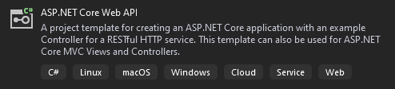

# 10_ASP.NET_Core6_WeatherForecastInstaller

## Prerequisites

A prerequisite for building the "10_WeatherForecastInstaller" project is that [dotnet 6](https://dotnet.microsoft.com/download/dotnet/6.0) is installed.<br/>
Prerequisite for installing the created installer is that:
- ASP.NET Core Runtime [Windows Hosting bundle](https://dotnet.microsoft.com/en-us/download/dotnet/thank-you/runtime-aspnetcore-6.0.27-windows-hosting-bundle-installer) is installed
- IIS is installed on the machine where the installer is running
- IIS has a website called "Default Web Site"

## WeatherForecast web application

The web application that will be deployed by the installer is the template "ASP.NET Core Web API" project:
<p align="left">
    
</p>

Web application project is not part of the solution but is instead built, published, and harvested during the pre-build event of the "10_WeatherForecastInstaller" project.<br/>
The only change done to the web application is the one that enables the project to be hosted in IIS.<br/>
Namely, the following line was added to the CreateHostBuilder method in Program.cs:
```C#
webBuilder.UseIIS();
```
Note that there is also the `webBuilder.UseIISIntegration()` method which should be used for out-of-process hosting.<br/>
Since we are using in-process hosting, we are using the UseIIS method<br/>
For more details about the two methods [see here](https://stackoverflow.com/a/55683314/15770755).

## Building and publishing WeatherForecast web application

The following statement builds and publishes the WeatherForecast web application:
```
dotnet publish $(ProjectDir)..\10_WeatherForecast\10_WeatherForecast.csproj -c $(ConfigurationName) --self-contained true -r win-x86
```

Since the 10_WeatherForecastInstaller project is (in the solution) built only for the x86 platform, the [Runtime Identifier](https://docs.microsoft.com/en-us/dotnet/core/rid-catalog) is hard-coded to `win-x86`.

NOTE: For the publish command to work and to [avoid error NETSDK1047](https://github.com/dotnet/aspnetcore/issues/24521), the following line must be added to 10_WeatherForecast.csproj:
```xml
<RuntimeIdentifiers>win-x86;win-x64</RuntimeIdentifiers>
```

The publish command is creating a [self-contained](https://docs.microsoft.com/en-us/dotnet/core/deploying/#publish-self-contained) deployment. This kind of publishing produces a platform-specific executable. The output publishing folder contains all components of the app, including the .NET libraries and target runtime. The publish folder for this kind of publishing contains more than 300 files. Manually creating a wxs file that would deploy all those files would be a lot of work - instead, the [WiX Heat tool](https://wixtoolset.org/documentation/manual/v3/overview/heat.html) will be used to generate the wxs file. The process of generating a wxs file out of a folder is called harvesting the folder.

## Harvesting WeatherForecast web application

The following statement harvests the WeatherForecast web application publish folder using heat.exe:
```
$(ProjectDir)..\..\packages\wix.3.14.1\tools\heat.exe dir $(ProjectDir)..\10_WeatherForecast\bin\$(ConfigurationName)\net6.0\win-x86\publish -cg WeatherForecastGroup -out $(ProjectDir)WeatherForecastGenerated.wxs -ag -sfrag -srd -sreg -dr MY_INSTALL_LOCATION -var var.InstallerSource
```

| Argument | Description |
| -------- | ------------- |
| dir      | Harvest a directory. |
| -cg      | Component group name (containing all the files). |
| -out     | Output wxs file. |
| -ag      | Auto-generate component guids at compile time, e.g. set Guid="*". |
| -sfrag   | Suppress generation of fragments for directories and components. |
| -srd     | Suppress harvesting the root directory as an element. |
| -dr      | Directory reference to root directories |
| -var     | Substitutes SourceDir with a preprocessor or a wix variable. |

In installer project build properties, an InstallerSource preprocessor variable is defined like this:
```
InstallerSource=..\10_WeatherForecast\bin\$(Configuration)\net6.0\win-x86\publish
```
$(ProjectDir) and $(ConfigurationName) used in the harvesting command line are [common macros for MSBuild](https://docs.microsoft.com/en-us/cpp/build/reference/common-macros-for-build-commands-and-properties).

## Running installed WeatherForecast web application using Kestrel

Including the generated *WeatherForecastGenerated.wxs* file into the project and referencing the *WeatherForecastGroup* from a WiX Feature element is enough to create an installer that will deploy the web application and all its runtime dependencies.

The default install location of the installer is "C:\Program Files (x86)\10_WeatherForecastInstaller". Installer deploys into that folder the *10_WeatherForecast.exe* which can be directly executed. If there are no custom parameters provided, running the executable will host the web application at an HTTP and an HTTPS endpoint using Kestrel. The WeatherForecast endpoint will be available at:
- http://localhost:5000/weatherforecast
- https://localhost:5001/weatherforecast

## WiX changes to host the web application in IIS

To host the web application in IIS, the installer needs to:
- create a new website in IIS, or use an existing one
- create an Application pool that will be used by the application
  - Note: if the Application pool is created out of a 32-bit installer, or a 64-bit installer with `Win64="no"`, this will result in an application pool that has the *"Enable 32-Bit Applications"* property set to *"True"*. This is fine for a 32-bit web application, but 64-bit web applications will not work with such an Application Pool.
- create a WebVirtualDir which will point to the location where the web application files are located
- create a WebApplication entity inside the WebVirtualDir
  - created WebApplication is created under the website previously mentioned
  - created WebApplication uses the previously created Application pool

All of the steps are implemented in the file [IISHostingFragment.wxs](10_WeatherForecastInstaller/IISHostingFragment.wxs).<br/>
One interesting point is that the installer is not creating a new website (nor deleting it on uninstall), but is instead expecting that a website named "Default Web Site" already exists. This is done by placing the [WebSite Wix element](https://wixtoolset.org/documentation/manual/v3/xsd/iis/website.html) under a Fragment. More details on that are in the linked wxs file.

Two additional changes are needed in the installer code to handle two specific issues.

### Setting AppPool ManagedRuntimeVersion

Because of an open issue in WiX, it is not possible to set the IIS Application Pool ManagedRuntimeVersion to "No Managed Code", which is the value that is preferred for ApplicationPools running .NET Core web applications. A workaround for that is a custom action that sets the correct ManagedRuntimeVersion using a [PowerShell script](10_WeatherForecastInstaller/SetAppPoolManagedRuntimeVersion.ps1). Details about the open issue and the workaround can be found [here](https://github.com/wixtoolset/issues/issues/5226#issuecomment-338707545).

### Granting write permission to web application for writing log files

A user under which the web application is running in IIS by default does not have write permission to the location where the web application files are deployed. And since that is the default location where IIS is writing the log file (as specified in web.config), the startup of the application will fail if logging is enabled. The [following custom action](https://stackoverflow.com/a/58451486) is used to grant FullAccess rights to the installation folder for the user under which the web application is running in IIS.

## Running installed WeatherForecast web application using IIS

With the changes done in the previous section, the WeatherForecast web application can be successfully installed in IIS.<br/>
The WeatherForecast endpoint will be available at:
- http://localhost/weatherforecastwebapp/weatherforecast/
- https://localhost/weatherforecastwebapp/weatherforecast/

Note: port and protocol depend on "Default Web Site" bindings.